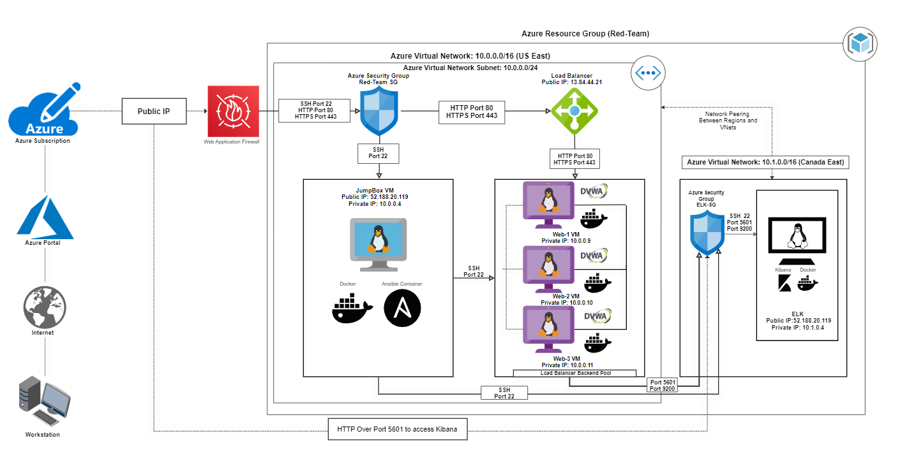

## Automated ELK Stack Deployment

The files in this repository were used to configure the network depicted below.

These files have been tested and used to generate a live ELK deployment on Azure. They can be used to either recreate the entire deployment pictured above. Alternatively, select portions of the  may be used to install only certain pieces of it, such as Filebeat.

This document contains the following details:
- Description of the Topolog
- Access Policies
- ELK Configuration
 - Beats in Use
 - Machines Being Monitored
- How to Use the Ansible Build

### Description of the Topology

The main purpose of this network is to expose a load-balanced and monitored instance of DVWA, the D*mn Vulnerable Web Application.

Load balancing ensures that the application will be highly avalaible, in addition to restricting traffic to the network.

Integrating an ELK server allows users to easily monitor the vulnerable VMs for changes to the logs and system metrics.

The configuration details of each machine may be found below.
| Name     | Function                     | IP Address | Operating System |
|----------|------------------------------|------------|------------------|
| Jump Box | Gateway                      | 10.0.0.1   | Linux  18.04-LTS |
| Web-1    | webserver for DVWA           | 10.0.0.9   | Linux  18.04-LTS |
| Web-2    | Redundant webserver for DVWA | 10.0.0.10  | Linux  18.04-LTS |
| Elk      | Kibana Web Server            | 10.1.0.4   | Linux  18.04-LTS |

### Access Policies

The machines on the internal network are not exposed to the public Internet. 

Only the Load Balancer and ELK machines can accept connections from the Internet. Access to this machine is only allowed from the following IP addresses: 
- 13.82.44.21 
- 52.229.116.195

Machines within the network can only be accessed by Jump Box.

A summary of the access policies in place can be found in the table below.

| Name                        | Publicly Accessible | Allowed IP Addresses |
|-----------------------------|---------------------|----------------------|
| Jump Box                    |  Yes                |40.117.134.50         |
| Web1 amd Web2 Load Balancer |  Yes                |13.82.44.21           |
| ELK VM                      |  Yes                |52.229.116.195        |

### Elk Configuration

Ansible was used to automate configuration of the ELK machine. No configuration was performed manually, which is advantageous because decrease human error and time saving, because you don't have to configure each machine manually and define one set of installation of config files.

The playbook implements the following tasks:
- Become Root
- Install Docker
- Install Python
- Install Docker Module
- Increase VIrtual Memory
- Downloand and Launch a Docker Elk Container
- Define communication ports

The following screenshot displays the result of running `docker ps` after successfully configuring the ELK instance.

### Target Machines & Beats
This ELK server is configured to monitor the following machines:
- 10.0.0.9
- 10.0.0.10

We have installed the following Beats on these machines:
- Filebeat
- Metricbeat

These Beats allow us to collect the following information from each machine:
- Filebeat collects all logs from specific log folders. E.g. /var/log/*.log
- Metricbeat helps you monitor your servers by collecting metrics from the system and services running on the server

### Using the Playbook
In order to use the playbook, you will need to have an Ansible control node already configured. Assuming you have such a control node provisioned: 

SSH into the control node and follow the steps below:
- Copy the  file to /etc/ansible/roles.
- Update the hosts file to include webservers group IPs
- Run the playbook, and navigate to PublicIPofKibanaServer:5601/app/kibana to check that the installation worked as expected.
